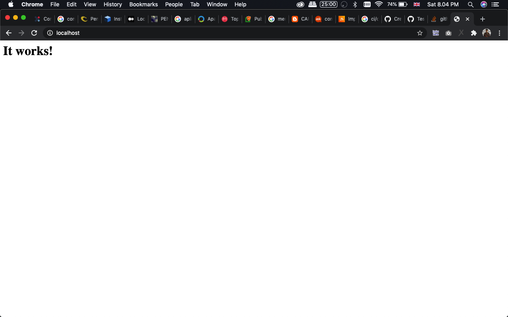
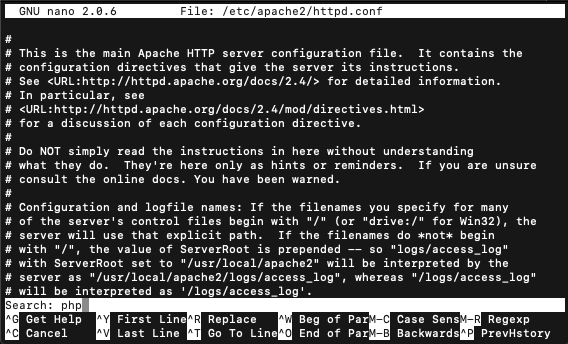
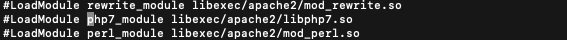
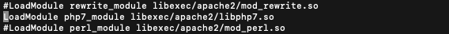
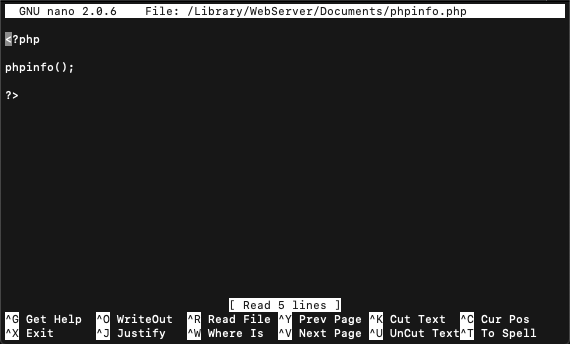
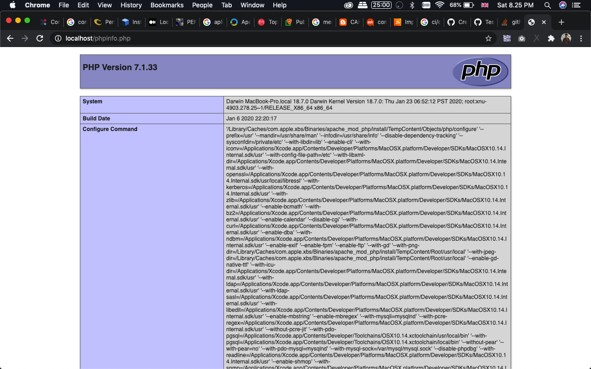
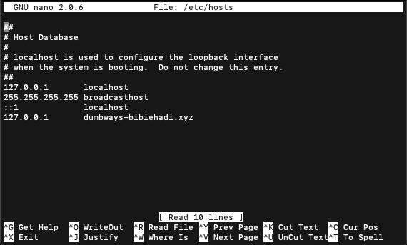
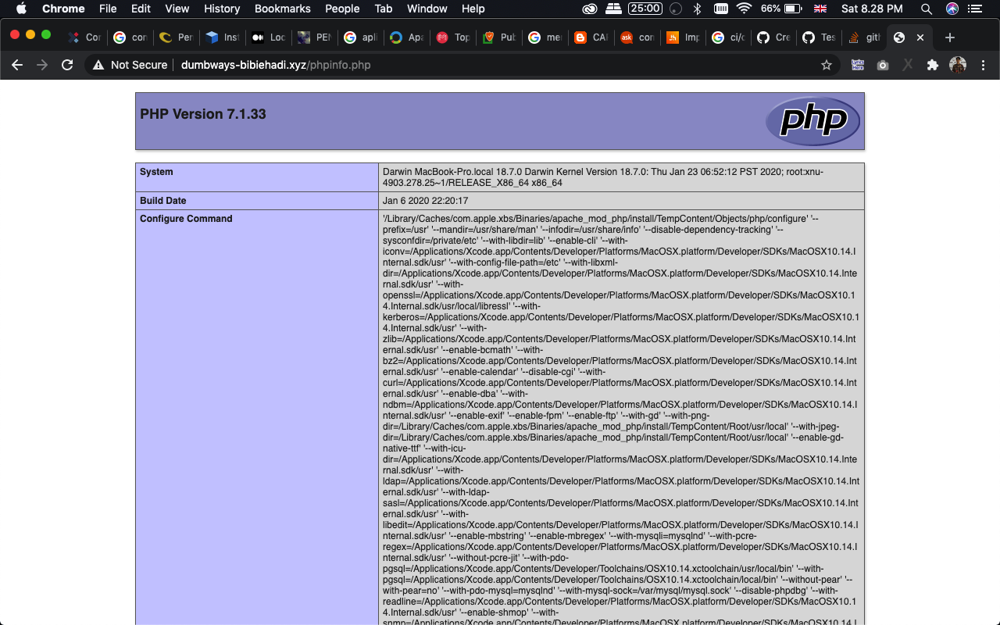
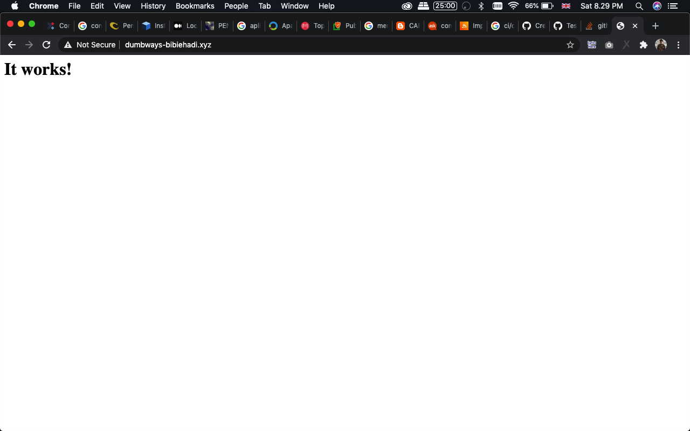

## Soal 8
Membuat Web Server Di MacOS, sebagai contoh (PHP)
1. Membuka Terminal 
2. login as root 
```
sudo su
```
3. Mencoba menstart service apache
```
apachectl start
```

4. Mengenable PHP di Apache
- buka file /etc/apache2/httpd.conf
```
nano /etc/apache2/httpd.conf
```
- mencari kode php, dengan menekan tombol ctrl + w lalu masukan 'php' enter

- setelah ketemu LoadModule php7_module libexec/apache2/libphp7.so hapus tanda # di depan script tersebut dan simpan



5. restart service apache
```
apachectl restart
```

6. Menambahkan file phpinfo.php di DocumentRoot
```
nano /Library/WebServer/Documents/phpinfo.php
```
Dan menambahkan script
```
<?php

phpinfo();

 ?>
```


7. Buka browser dan access http://localhost/phpinfo.php


8. Merubah localhost ke domain dumbways-bibiehadi.xyz
buka /etc/host, dan tambahkan 127.0.0.1       dumbways-bibiehadi.xyz
```
nano /etc/host

127.0.0.1       dumbways-bibiehadi.xyz
```


9. Mencoba webserver dengan mengakses dumbways-bibiehadi.xyz




